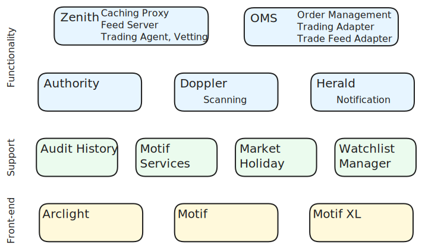

import { ComponentShort } from '@shared';

The diagram below shows the main components of the Plxtra architecture and shows the functionalities each component implements (hand drawn font).

## Functionality back-end

* **[{ ComponentShort.authority.label }](./authority/)**: { ComponentShort.authority.description }
* **[{ ComponentShort.zenith.label }](./zenith/)**: { ComponentShort.zenith.description }
* **[{ ComponentShort.oms.label }](./oms/)**: { ComponentShort.oms.description }
* **[{ ComponentShort.doppler.label }](./doppler/)**: { ComponentShort.doppler.description }
* **[{ ComponentShort.herald.label }](./herald/)**: { ComponentShort.herald.description }

## Support back-end
* **[{ ComponentShort.auditHistory.label }](./audit-history/)**: { ComponentShort.auditHistory.description }
* **[{ ComponentShort.motifServices.label }](./motif-services/)**: { ComponentShort.motifServices.description }
* **[{ ComponentShort.marketHoliday.label }](./market-holiday/)**: { ComponentShort.marketHoliday.description }
* **[{ ComponentShort.watchlistManager.label }](./watchlist-manager/)**: { ComponentShort.watchlistManager.description }

## Front-end applications
* **[{ ComponentShort.motif.label }](./motif/)**: { ComponentShort.motif.description }
* **[{ ComponentShort.arclight.label }](./arclight/)**: { ComponentShort.arclight.description }
* **[{ ComponentShort.motifXL.label }](./motif-xl/)**: { ComponentShort.motifXL.description }
