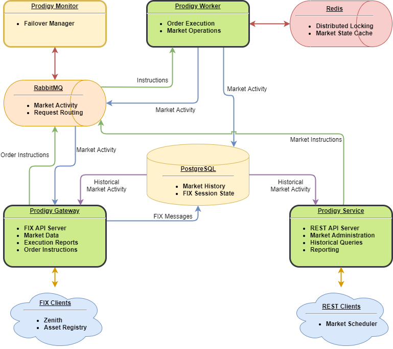

Prodigy is a trading exchange matching engine which has been built with a plug-in and extensible architecture that allows different types of markets to be hosted in the one exchange. Plugins can be easily added or removed facilitating the development of markets and allowing easy transitioning to new releases with new capabilities.

* *Functionalities - [Exchange Engine](../../functionalities/exchange-engine/) [Fix Server](../../functionalities/fix-server/)*
* *APIs*
    * *Market Control - Add and remove listings on markets. Also publish news items.*
    * *Market Reports - Obtain reference and historical data.*
    * *FIX - Order requests, execution reports, and market data.*
* *Extensibility*
    * *Market Model plugins - Extend the basic model of a Symbol, Order, or Trade with additional business information.*
    * *Execution Engine plugins - Add new logic for matching orders, and new market operations to manipulate the state of the market.*
    * *FIX application plugins - Customise the FIX protocol spoken by the server.*

## Elements and extensibility

The basic elements of Prodigy are:

* Markets
* Symbols
* Orders
* Trades
* Brokers

However, the actual behaviour of these elements is defined by 2 plug-in types:

1. “Data Model” plug-ins define the extended properties of the basic elements
2. “Execution Engines” plug-ins define the interaction between the extended elements defined in the “Data Model”.

The plug-ins are per market.  This allows one exchange to host markets with different plug-ins; allowing exchanges to have markets with very different behaviour. An [equity trading plug-in](./equity-plugin) is available.

## Data/Trading API

The exchange comes with a complete suite of API interfaces allowing uses to place orders and receive data.  There are 3 interfaces:

* FIX – An industry standard method of placing trades and retrieving data.  Useful for connecting to enterprises.
* Web Socket streaming – A streaming API providing access to all features of the exchange.  This API is like FIX but uses standard web technologies which many developers are familiar with.
* HTTP Rest – A request/response API using HTTP calls.  A simpler API to work for developers not experienced in event driven software development.

All API interfaces allow the placement of new, amend and cancel order requests.  In addition, they provide access to the following data streams/responses:

* Orders
* Order Audit
* Depth
* Trades (Streaming and Historical)
* Price History (Historical intervalised in range from 1 minute to 2 weeks)

## Management API
The exchange is managed with the [Market Control](/market-control-api/) API.

All methods allow the following aspects of the exchange to be managed:

* Add/Remove/Manage Markets.  This includes specifying the plug-ins (Data Model and Execution Engine) for the markets.  In addition, you can set up phases and parameters for execution engines (eg. Market Integrity).
* Add/Remove/Manage Symbols.  Specify code, name and status.
* Add/Remove/Manage FIX sessions.  This includes specifying market and access, whether broker private data is visible, determining what data streams are available (eg, Orders)
* Add/Remove Brokers
* Add/Remove/Manage FIX accounts.  Provide authentication for access to sessions.
* Add/Remove/Manage Entities.  Entities are businesses or people who are provided with API access to the system.
Scalability and Availability

The system has been designed to grow to meet whatever scale is needed.  By using worker processes to handle Order Execution and Event Processing, workloads can be spread across as many machines as needed.  It can also be scaled to increase throughput.  By limiting the number of symbols handled on each computer the throughput for individual symbols can be increased.  It would be quite feasible to have 1,000,000 trades per second with sufficient computing resources.

Availability can be specified according to business and cost requirements.  For low cost deployments it is possible to configure the system without redundancy.  However, the system has been designed so that it can be deployed with redundancy for all components.  This includes:

* Computer failure
* Queue failure (queue clusters)
* Database (mirroring)
* Cache (master/slave)

In addition, it is possible to update some components online to allow upgrades without any system downtime.

## Standard Infrastructure
To ensure infrastructure costs are kept as low as possible and easily maintained, the exchange is used by industry standard platforms – using open source where possible.  The main infrastructure components are:

* Operating System: Deploy on Windows or Linux
* Postgres SQL (Database)
* Rabbit (Queuing)
* Redis (Caching)

This infrastructure can easily be set up in your own hosting space or in a cloud environment.

## Design Goals

The primary objectives for the Prodigy Matching Enginer are:

* Reliability\
Prodigy should function around the clock and be tolerant of faults.
* Scalability\
Prodigy should horizontally scale to meet growing requirements.
* Extensibility\
Prodigy should be easily adapted to suit a variety of needs.
* Performance\
Prodigy should perform tasks within a reasonable timeframe.
* Flexibility\
Prodigy should not involve unnecessary third-party dependencies

## Architecture
The Prodigy Exchange consists of three main services, plus four support services.

 
## Main Services

The three main services that form Prodigy are the Worker, the Gateway, and the Web Service.

1. Prodigy Gateway\
The Gateway is the primary streaming data interface, where market and execution activity are distributed, and where order instructions can be submitted.\
The Gateway utilises the FIX 5.0 protocol.
1. Prodigy Web Service\
The Web Service provides market control operations and querying of current market state and historical activity.\
The Web Service utilises standard HTTP requests.
1. Prodigy Worker\
The Worker applies execution instructions and market control operations to the market state. This is where the matching engine performs its work.\
The Worker is internal to Prodigy and does not have any external-facing interfaces.

## Support Services

* Prodigy Monitor\
The Monitor performs maintenance tasks to ensure proper and speedy failover between Workers.
* PostgreSQL\
Prodigy utilises PostgreSQL 10 (or higher) for persistent storage of market activity, as well as managing FIX session state.\
These two tasks are independent and can exist in separate instances for reliability and performance.
* RabbitMQ\
Prodigy utilises RabbitMQ for communication between the high-level components. It ensures requests are sent to the correct Worker and distributes market activity back to the Gateways.
* Redis\
Prodigy utilises Redis for coordination between Workers and caching of the market state.

## Reliability

Prodigy is intended for 24-hour availability, with zero down-time even in the event of system upgrades.
To achieve this, all components of Prodigy can be run in a redundant manner.

* Gateway – FIX sessions can be resumed from any instance.
* Web Service – The REST API is stateless and all instances are identical.
* Worker – Instructions will automatically be rerouted in the event of a fault.
* Monitor – Failover tasks can be performed by any instance.
* PostgreSQL – Supports mirroring for fault tolerance
* RabbitMQ – Supports clustering for fault tolerance
* Redis – Supports clustering for fault tolerance

Additionally, order operations are only confirmed once the action has been written to the database, so in the event of a widespread system failure, the possibility of data loss is minimal to non-existent.

## Scalability
Prodigy is intended to scale based on the workload required.

Both the Gateway and Web Services can horizontally scale and be load-balanced.

Workers function in a cluster and scale based on the number of active symbols. Inactive (no recent activity) symbols do not consume any resources. New Workers can be added or removed dynamically, with automated migration of any active symbols. 

RabbitMQ and Redis both support clustering, allowing their load to be distributed across multiple machines if necessary.

Prodigy utilises PostgreSQL in a very write-heavy manner, so the benefits of replication regarding exchange throughput are minimal. However, we do not anticipate this being a problem for anything but the heaviest workloads.

## Extensibility
Prodigy is designed to be an extensible framework for building an exchange, easing the burden on implementors.

It achieves this goal by providing three points of extensibility:

* The Data Model, which defines what properties the various elements of the exchange possess, and the events that alter them
* The Execution Engine, which defines operations on the Data Model
* The Translation Layer, which formats the Data Model into FIX messages for consumption

Additionally, a single Prodigy installation can run multiple exchanges with different models, execution engines, and translation layers in parallel. New exchanges can be created while the system is running.

## Performance

Prodigy is designed to have an acceptable baseline of performance, while prioritising the previous goals: reliability, scalability, and extensibility.

Additionally, Prodigy prioritises throughput over latency, such that a single instruction can take some time to flow through the system, even while the overall number of executions per second remains high.

For these reasons, Prodigy is not intended to be a high-frequency-trading platform.

## Flexibility

Prodigy is intended to run in as many environments as possible.

All the components of Prodigy are built on .Net Core, and are capable of running on Windows or Linux hosts.

Prodigy can be containerised through services such as Docker.

Prodigy does not require specialised hardware, and is intended to run on standard commodity infrastructure, both cloud and in-house. Prodigy does not depend on any one cloud provider.
