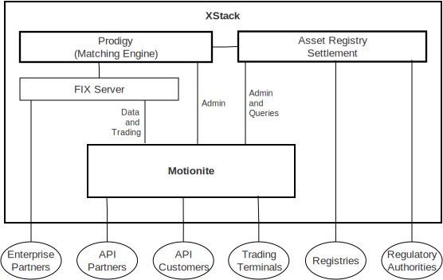

## Principles

Plxtra is intended to be modular and customisable, to support as many business scenarios as possible, rather than offering a specific one-size-fits-all solution. No matter how big or small your business is, no matter what systems you need to integrate with, Plxtra has a solution.

- Modular: Components have clearly defined roles and APIs, each focused on its area of expertise.
- Customisable: Plugins are supported where applicable, allowing for easy extensibility and integration.
- Available: Components are designed for scalability and redundancy, from single instances up to large clusters, to support any amount of load and reliability requirements.
- Realtime: Create markets, issue symbols, add accounts and users, trade, and settle, all in realtime. But if you have batch systems, we support those too.
- Retail-focused: From the exchange to your phone and desktop, we provide the components needed to get started.

Plxtra is not a high-frequency trading platform. It is intended for retail systems, optimised for throughput with a large number of customers rather than low latency for one or two.
