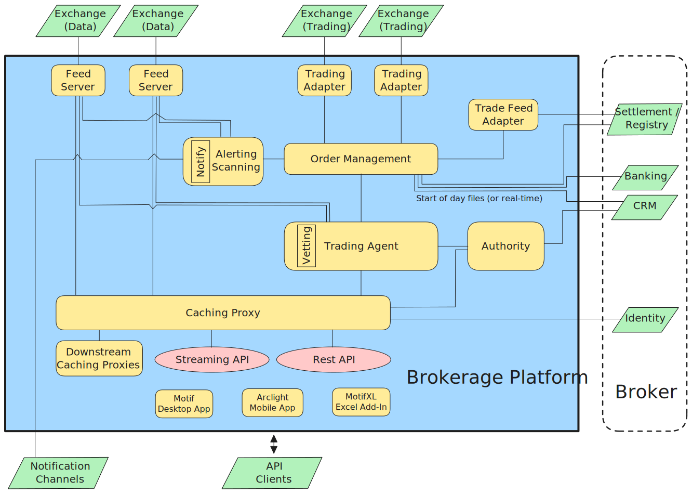

import FunctionalityShortItem from '@components/FunctionalityShortItem.astro';
import { FunctionalityShort } from '@shared';

Plxtra has been architected around these [principles](./principles/).

## Functionalities

The diagram below shows a top level view of the functionality within Plxtra.

The functionalities are:

- <FunctionalityShortItem short={FunctionalityShort.feedServer} />
- <FunctionalityShortItem short={FunctionalityShort.tradingAdapter} />
- <FunctionalityShortItem short={FunctionalityShort.tradeFeedAdapter} />
- <FunctionalityShortItem short={FunctionalityShort.orderManagement} />
- <FunctionalityShortItem short={FunctionalityShort.tradingAgent} />
- <FunctionalityShortItem short={FunctionalityShort.vetting} />
- <FunctionalityShortItem short={FunctionalityShort.authority} />
- <FunctionalityShortItem short={FunctionalityShort.cachingProxy} />
- <FunctionalityShortItem short={FunctionalityShort.alertingScanning} />
- <FunctionalityShortItem short={FunctionalityShort.motif} />
- <FunctionalityShortItem short={FunctionalityShort.arclight} />
- <FunctionalityShortItem short={FunctionalityShort.motifXL} />

## Components

The above functionalities are implemented in various Plxtra components. The full list of components can be accessed [here](./components/).

## Other information

- **[Databases](./databases/)**
- **[Redundancy](./redundancy)**
- **[Monitoring](./monitoring)**
- **[Protection](./protection)**
