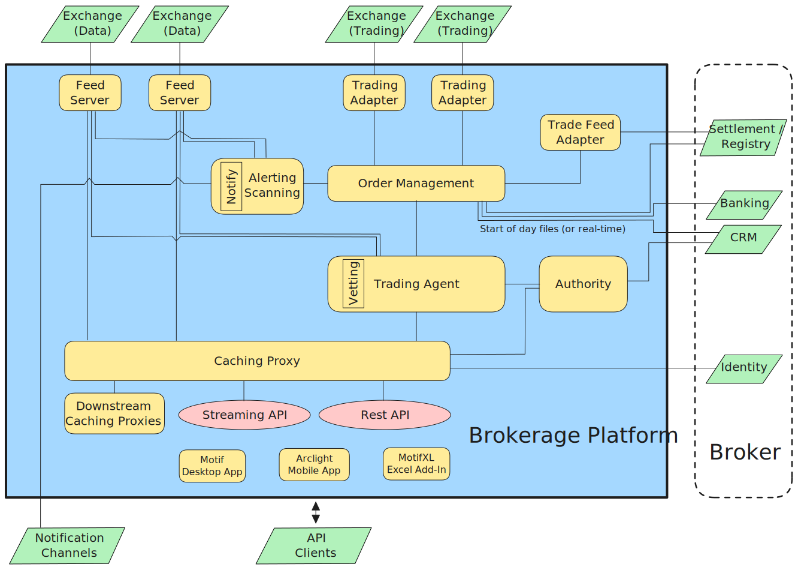

import FunctionalityShortItem from '@components/FunctionalityShortItem.astro';
import { FunctionalityShort } from '@shared';

Plxtra has been architected around these [principles](./principles/).

It can be configured in meet various trading platform use cases.  For example:

* A full retail exchange platform with registry, exchange engine, FIX server, and brokerage platform,
* A retail exchange platform using an external registry,
* An exchange platform with multiple brokers,
* A brokerage platform connecting to one or more external exchanges.

## Full Exchange Platform

At the highest level, Plxtra is a full exchange as shown below:

The main functionalities are:

* <FunctionalityShortItem short={FunctionalityShort.registry}/>
* <FunctionalityShortItem short={FunctionalityShort.exchangeEngine}/>
* <FunctionalityShortItem short={FunctionalityShort.fixServer}/>
* **Brokerage Platform**: Implements services typically operated by a broker 

## Brokerage Platform Functionalities

The diagram below shows a top level view of the functionality within the Brokerage Platform.

Note that when used as part of the Plxtra exchange platform (above), this does not imply that an exchange needs to have a broker.  The exchange itself can carry out the brokerage operations.  Also, note that this diagram shows an external registry/settlement (as would typically be the case with brokers) whereas the Plxtra exchange platform itself already contains a registry.

The functionalities are:

* <FunctionalityShortItem short={FunctionalityShort.feedServer} />
* <FunctionalityShortItem short={FunctionalityShort.tradingAdapter} />
* <FunctionalityShortItem short={FunctionalityShort.tradeFeedAdapter} />
* <FunctionalityShortItem short={FunctionalityShort.orderManagement} />
* <FunctionalityShortItem short={FunctionalityShort.tradingAgent} />
* <FunctionalityShortItem short={FunctionalityShort.vetting} />
* <FunctionalityShortItem short={FunctionalityShort.authority} />
* <FunctionalityShortItem short={FunctionalityShort.cachingProxy} />
* <FunctionalityShortItem short={FunctionalityShort.alertingScanning} />
* <FunctionalityShortItem short={FunctionalityShort.motif} />
* <FunctionalityShortItem short={FunctionalityShort.arclight} />
* <FunctionalityShortItem short={FunctionalityShort.motifXL} />

## Components

The above functionalities are implemented in various Plxtra components. The full list of components can be accessed [here](./components/).

## Other information

* **[Databases](./databases/)**
* **[Connecting banks and registries](./connecting-banks-and-registries/)**
* **[Redundancy](./redundancy)**
* **[Monitoring](./monitoring)**
* **[Protection](./protection)**

