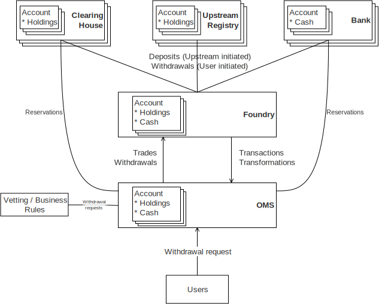

Foundry is a synchronisation registry and settlement system. It keeps track of accounts, their transactions and their holdings and cash balances. It interacts with a downstream Order Management System (OMS) which notifies it of withdrawals and executed trades. Foundry performs the necessary settlement actions and issues contract notes.

Foundry can also communicate with upstream registries, clearing houses or banks which are the ‘source of truth’ for some
accounts and data types.

The block diagram below shows these various entities and their interactions.

For holdings and cash data, it is necessary to specify one entity as being the ‘source of truth’ for this data. There may be different sources of truth for holdings and cash. There may even be different sources for different accounts.

If a system in the above diagram is the ‘source of truth’ for data, then all other systems need to synchronise with that data in that system. The synchronisation may not involve reflecting all the data from the ‘source of truth’ - only to the extent that it is needed in a system. For example, the OMS is generally not interested in historical transactions and will typically only synchronise with the latest balances.

The OMS is never the ‘source of truth’ for persisted data. It will interact with Foundry in real time to receive any changes to accounts in Foundry. However during trading hours, whenever trades or reservations occur, OMS will update its internal accounts to reflect these changes.
